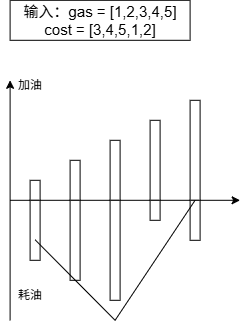

+++
date = '2026-09-18T10:10:48+08:00'
draft = false
title = 'Leetcode 面试150题——数组与字符串 总结'
summary = '归纳这个部分每道题的题解，使用Go语言'
tags = ['Leetcode', '题解汇总', '数组与字符串']
series = ['面试150题']
featured = true
math = true
+++

# 合并两个有序数组
> 难度：简单

> 标签：数组、双指针、排序

> 链接：[合并两个有序数组](https://leetcode.cn/problems/merge-sorted-array/description/?envType=study-plan-v2&envId=top-interview-150)



给你两个按`非递减顺序`排列的整数数组`nums1`和`nums2`，另有两个整数 m 和 n ，分别表示`nums1`和`nums2`中的元素数目。

请你 合并`nums2`到`nums1`中，使合并后的数组同样按`非递减顺序`排列。

注意：最终，合并后数组不应由函数返回，而是存储在数组`nums1`中。为了应对这种情况，`nums1`的初始长度为 m + n，其中前 m 个元素表示应合并的元素，后 n 个元素为 0 ，应忽略。`nums2`的长度为 n 。


这道题的解法有三种：
1. **合并后排序**。比较简单无脑。时间复杂度$O((m+n)\log(m+n))$，空间复杂度是$O(\log(m+n))$。
2. **正向双指针**。用一个额外的数组，然后每次从两个数组的头部取较小的数存进去。时间复杂度和空间复杂度都是$O(m+n)$。
3. **逆向双指针**。原地修改，每次从两个数组尾部取较大的数存到`num1`尾部的空白里。时间复杂度$O(m+n)$，空间复杂度$O(1)$。



这里只给出解法3的代码，因为题目优化也是希望可以实现原地修改。
```go
func merge(nums1 []int, m int, nums2 []int, n int) {
	tail := m + n - 1
	p1, p2 := m-1, n-1
	for p2 >= 0 {
		if p1 >= 0 && nums1[p1] >= nums2[p2] {
			nums1[tail] = nums1[p1]
			p1--
		} else {
			nums1[tail] = nums2[p2]
			p2--
		}
        tail--
	}
}
```
---

# 移除元素
> 难度：简单

> 标签：数组、双指针

> 链接：[移除元素](https://leetcode.cn/problems/remove-element/?envType=study-plan-v2&envId=top-interview-150)



给你一个数组`nums`和一个值`val`，你需要**原地**移除所有数值等于`val`的元素。元素的顺序可能发生改变。然后返回`nums`中与`val`不同的元素的数量。

假设`nums`中不等于`val`的元素数量为 k，要通过此题，您需要执行以下操作：

- 更改`nums`数组，使`nums`的前 k 个元素包含不等于`val`的元素。`nums`的其余元素和`nums`的大小并不重要。
- 返回 k。


这道题的解法有两种：
1. **双指针1**。两个指针都从头出发，先移动右指针，每次遍历判断`nums[right]`是否等于`val`。如果等于，说明这个值要移除，我们就单纯移动右指针；如果不等于，说明这个值要保留，我们就让`nums[left] = nums[right]`，然后左右指针同时移动。时间复杂度$O(n)$，空间复杂度是$O(1)$。
2. **双指针2**。原先双指针的遍历移动有些繁琐。实际上我们观察题目会发现，这道题移除的元素都是放到数组末尾的。所以我们可以让两个指针分别位于数组的首尾，移动左指针，遇到`nums[left] == val`就让`nums[left] = nums[right]`。时间复杂度$O(n)$，空间复杂度是$O(1)$。



下面给出两种解法的实现代码。



```go
func removeElement(nums []int, val int) int {
    left := 0
    for _, v := range nums {
        if v != val {
            nums[left] = v
            left++
        }
    }
    return left
}
```


```go
func removeElement(nums []int, val int) int {
    left, right := 0, len(nums)
    for left < right {
        if nums[left] == val {
            nums[left] = nums[right-1]
            right--
        } else {
            left++
        }
    }
    return left
}
```


    
---

# 删除有序数组中的重复项
> 难度：简单

> 标签：数组、双指针

> 链接：[删除有序数组中的重复项](https://leetcode.cn/problems/remove-duplicates-from-sorted-array/?envType=study-plan-v2&envId=top-interview-150)  



给你一个`非严格递增排列`的数组`nums`，请你**原地**删除重复出现的元素，使每个元素**只出现一次**，返回删除后数组的新长度。元素的**相对顺序**应该保持**一致**。然后返回`nums`中唯一元素的个数。

考虑`nums`的唯一元素的数量为 k。去重后，返回唯一元素的数量 k。

`nums`的前 k 个元素应包含**排序后**的唯一数字。下标 k - 1 之后的剩余元素可以忽略。


**双指针**

定义一个变量`lastDiff`存储上一个不同的数。两个指针都从头出发，先移动右指针，每次遍历判断`nums[right]`是否等于`lastDiff`。如果等于，说明这个值有了，我们就单纯移动右指针；如果不等于，说明这个值要保留，我们就让`nums[left] = nums[right]`，然后左右指针同时移动，记录当前值为新的`lastDiff`。时间复杂度$O(n)$，空间复杂度是$O(1)$。



下面给出实现代码。

```go
func removeDuplicates(nums []int) int {
    left, lastDiff := 0, -200

    for _, num := range nums {
        if num != lastDiff {
            nums[left] = num
            lastDiff = num
            left++
        }
    }

    return left
}
```
---

# 删除有序数组中的重复项 II
> 难度：中等

> 标签：数组、双指针

> 链接：[删除有序数组中的重复项 II](https://leetcode.cn/problems/remove-duplicates-from-sorted-array-ii/?envType=study-plan-v2&envId=top-interview-150)  



给你一个有序数组`nums`，请你**原地**删除重复出现的元素，使得出现次数超过两次的元素只出现**两次** ，返回删除后数组的新长度。

不要使用额外的数组空间，你必须在**原地**修改输入数组 并在使用$O(1)$额外空间的条件下完成。


**双指针**

两个指针都从位置2出发，先移动右指针，每次遍历判断`nums[right]`是否等于`nums[left]`(就是上上个元素，保证每个数字有两个)。如果等于，说明这个值有两个了，我们就单纯移动右指针；如果不等于，说明这个值要保留，我们就让`nums[left] = nums[right]`，然后左右指针同时移动。时间复杂度$O(n)$，空间复杂度是$O(1)$。



下面给出实现代码。

```go
func removeDuplicates(nums []int) int {
    n := len(nums)
    if n <= 2 {
        return n
    }
    left, right := 2, 2
    for right < n {
        if nums[left-2] != nums[right] {
            nums[left] = nums[right]
            left++
        }
        right++
    }
    return left
}
```
---

# 多数元素
> 难度：简单

> 标签：数组、哈希表、分治、计数、排序、摩尔投票算法

> 链接：[多数元素](https://leetcode.cn/problems/majority-element/?envType=study-plan-v2&envId=top-interview-150)  



给定一个大小为 n 的数组`nums`，返回其中的多数元素。多数元素是指在数组中出现次数`大于 ⌊ n/2 ⌋`的元素。

你可以假设数组是非空的，并且给定的数组总是存在多数元素。


这道题说白了就是求众数，解法比较多样，我挑了几个解法学习：
1. **哈希表**。用一个哈希表去记录每个数字出现的次数。如果当前这个数字超过了最大次数`cnt`，我们就把它记为当前的众数`majority`。一直更新直到结束。时间复杂度$O(n)$，空间复杂度是$O(n)$。
2. **排序**。既然是求众数，那我就先对数组进行排序。因为题干假定了众数必然存在，所以下标为`⌊ n/2 ⌋`的一定就是众数。时间复杂度$O(n\log n)$，空间复杂度是$O(\log n)$。
3. **随机化**。感觉这个方法有点哭笑不得。由于众数占据数据一半以上的下标，所以我们可以每次随机选择一个下标，然后计算这个下标对应的数在数组里的数量是否超过一半。因为是众数所以随机到需要的次数挺少的。时间复杂度$O(n)$，空间复杂度是$O(1)$。
4. **摩尔投票**。求绝对众数的一个很精彩的方法。因为众数在数组里有一半以上，所以众数的数量大于剩下所有元素的个数之和。所以我们可以定义一个量`vote`，每次遇到众数+1，遇到非众数-1(初始化第一个数是众数)。同时我们可以推得，如果前面x个数的票数和是0，那么剩下数的票数必定大于0，众数始终是不变的。所以当票数为0，我们就设置当前位置的数是众数继续执行。时间复杂度$O(n)$，空间复杂度是$O(1)$。



下面解法顺序给出题解。



```go
func majorityElement(nums []int) int {
    hash := map[int]int{}
    majority, cnt := 0, 0
    for _, num := range nums {
        hash[num]++
        if hash[num] > cnt {
            majority = num
            cnt = hash[num]
        }
    }
    return majority
}
```


```go
func majorityElement(nums []int) int {
    slices.Sort(nums)
    return nums[len(nums) / 2]
}
```


```go
func majorityElement(nums []int) int {
    n := len(nums)
    for {
        rand.Seed(time.Now().UnixNano())
        candidate := nums[rand.Intn(n)]
        count := 0
        for _, num := range nums {
            if num == candidate {
                count++
            }
        }
        if count > n / 2 {
            return candidate
        }
    }
    return -1
}
```


```go
func majorityElement(nums []int) (ans int) {
    vote := 0
    for _, num := range nums {
        if vote == 0 {
            ans, vote = num, 1
        } else if num == ans {
            vote++
        } else {
            vote--
        }
    }
    return
}
```



---

# 轮转数组
> 难度：中等

> 标签：数组、数学、双指针

> 链接：[轮转数组](https://leetcode.cn/problems/rotate-array/?envType=study-plan-v2&envId=top-interview-150)  



给定一个整数数组`nums`，将数组中的元素向右轮转 k 个位置，其中 k 是非负数。



**反转数组**

先对整个数组进行反转，然后将前 k 个元素反转，再对剩下的元素进行反转即可。时间复杂度$O(n)$，空间复杂度是$O(1)$。



下面给出解法。

```go
func rotate(nums []int, k int)  {
    k %= len(nums)
    slices.Reverse(nums)
    slices.Reverse(nums[:k])
    slices.Reverse(nums[k:])
}
```

---

# 买卖股票的最佳时机
> 难度：简单

> 标签：数组、动态规划

> 链接：[买卖股票的最佳时机](https://leetcode.cn/problems/best-time-to-buy-and-sell-stock/?envType=study-plan-v2&envId=top-interview-150)



给定一个数组`prices`，它的第 i 个元素`prices[i]`表示一支给定股票第 i 天的价格。

你只能选择**某一天**买入这只股票，并选择在**未来的某一个不同的日子**卖出该股票。设计一个算法来计算你所能获取的最大利润。

返回你可以从这笔交易中获取的最大利润。如果你不能获取任何利润，返回 0 。



**动态规划**

我们先定义三个变量：`price`当天价格，`minCost`最低成本，`maxProfit`最大利润。

每获取到一个`price`，我们就比较是不是`minCost`，是的话设置新的最低成本。然后计算当前利润，和`maxProfit`比较，大于的话设置新的最大利润，最后返回`maxProfit`。时间复杂度$O(n)$，空间复杂度是$O(1)$。



下面给出解法。

```go
func maxProfit(prices []int) int {
    minCost, maxProfit := prices[0], 0
    for _, price := range prices {
        minCost = min(minCost, price)
        maxProfit = max(maxProfit, price - minCost)
    }
    return maxProfit
}
```

---

# 买卖股票的最佳时机 II
> 难度：中等

> 标签：数组、动态规划、贪心

> 链接：[买卖股票的最佳时机 II](https://leetcode.cn/problems/best-time-to-buy-and-sell-stock-ii/?envType=study-plan-v2&envId=top-interview-150)



给你一个整数数组`prices`，其中`prices[i]`表示某支股票第 i 天的价格。

在每一天，你可以决定是否购买和/或出售股票。你在任何时候**最多**只能持有**一股**股票。然而，你可以在**同一天**多次买卖该股票，但要确保你持有的股票不超过一股。

返回你能获得的**最大**利润。



**动态规划 + 贪心算法**

这道题的判断是，只要明天的价格比今天高，那我就今天买明天卖。时间复杂度$O(n)$，空间复杂度是$O(1)$。



下面给出解法。

```go
func maxProfit(prices []int) int {
    profit := 0
    n := len(prices)
    for i := range n-1 {
        x, y := prices[i], prices[i+1]
        if x < y {
            profit += y-x
        }
    }
    return profit
}
```
---

# 跳跃游戏
> 难度：中等

> 标签：数组、动态规划、贪心

> 链接：[跳跃游戏](https://leetcode.cn/problems/jump-game/?envType=study-plan-v2&envId=top-interview-150)



给你一个非负整数数组`nums`，你最初位于数组的**第一个下标**。数组中的每个元素代表你在该位置可以跳跃的最大长度。

判断你是否能够到达最后一个下标，如果可以，返回`true`；否则，返回`false`。



**动态规划 + 贪心算法**

定义一个变量`distance`记录最远可达下标。遍历数组的每一个元素，记录当前位置可以到达的最远下标，与`distance`进行比较，大于的话则更新`distance`。如果当前下标大于`distance`，那就说明到不了，`return false`。时间复杂度$O(n)$，空间复杂度是$O(1)$。



下面给出解法。

```go
func canJump(nums []int) bool {
    distance := 0
    for i, jump := range nums {
        if i > distance {
            return false
        }
        distance = max(distance, i+jump)
    }
    return true
}
```

---

# 跳跃游戏 II
> 难度：中等

> 标签：数组、动态规划、贪心

> 链接：[跳跃游戏 II](https://leetcode.cn/problems/jump-game-ii/?envType=study-plan-v2&envId=top-interview-150)



给定一个长度为 n 的 0 索引整数数组`nums`。初始位置在下标 0。

每个元素`nums[i]`表示从索引 i 向后跳转的最大长度。换句话说，如果你在索引 i 处，你可以跳转到任意 (i + j) 处：

- `0 <= j <= nums[i]`且
- `i + j < n`

返回到达 n - 1 的最小跳跃次数。测试用例保证可以到达 n - 1。



这道题解法也是**动态规划 + 贪心算法**，但是有两种贪心的策略：
1. **正向贪心**。定义两个变量`curEnd`和`nextEnd`，分别代表当前的最远边界和下一个最远边界。从贪心的角度，每次跳我们都跳到最远，那最后需要的次数就是最少的。从第一个元素出发，不断更新下一个最远边界，当走到当前边界，我就跳到下一个最远边界，步数+1。时间复杂度$O(n)$，空间复杂度是$O(1)$。
2. **反向贪心**。因为我们总要跳到最后一个位置，不妨就从最后出发，往前找能够跳到最后的下标。如果存在多个下标，为了少跳，就要选择最远的那个下标，不断更新和查找直到回到下标0。时间复杂度$O(n^2)$，空间复杂度是$O(1)$。



下面给出解法。



```go
func jump(nums []int) (ans int) {
    curEnd := 0
    nextEnd := 0
    for i, num := range nums[:len(nums)-1] {
        nextEnd = max(nextEnd, i+num)
        if i == curEnd {
            curEnd = nextEnd
            ans++
        }
    }
    return
}
```



```go
func jump(nums []int) (ans int) {
    pos := len(nums) - 1
    for pos > 0 {
        for i := 0; i < pos; i++ {
            if i + nums[i] >= pos {
                pos = i
                ans++
                break
            }
        }
    }
    return
}
```



---

# H指数
> 难度：中等

> 标签：数组、计数排序、排序

> 链接：[H指数](https://leetcode.cn/problems/h-index/?envType=study-plan-v2&envId=top-interview-150)



给你一个整数数组`citations`，其中`citations[i]`表示研究者的第 i 篇论文被引用的次数。计算并返回该研究者的 h 指数。

根据维基百科上 h 指数的定义：h 代表“高引用次数” ，一名科研人员的 h 指数是指他（她）至少发表了 h 篇论文，并且**至少**有 h 篇论文被引用次数大于等于 h 。如果 h 有多种可能的值，h 指数是其中最大的那个。



这道题有两种解法：
1. **排序**。首先我们可以将初始的 h 设为 0，然后将引用次数排序，并且对排序后的数组从大到小遍历。根据 H 指数的定义，如果当前 H 指数为 h 并且在遍历过程中找到当前值`citations[i] > h`，则说明我们找到了一篇被引用了至少 h+1 次的论文，所以将现有的 h 值加 1。继续遍历直到 h 无法继续增大。最后返回 h 作为最终答案。时间复杂度$O(n\log n)$，空间复杂度是$O(\log n)$。
2. **计数排序**。对比第一种解法，由于 h 指数肯定不能大于总的论文数目，所以对于引用次数大于论文数的我们就按论文数算。同时引入一个 cnt 数组来记录当前引用次数对应几篇论文，然后还是从大到小遍历。时间复杂度$O(n)$，空间复杂度是$O(n)$。



下面给出解法。



```go
func hIndex(citations []int) (h int) {
    sort.Ints(citations)
    for i := len(citations) - 1; i >= 0 && citations[i] > h; i-- {
        h++
    }
    return
}
```



```go
func hIndex(citations []int) int {
    n := len(citations)
    cnt := make([]int, n+1)
    for _, c := range citations {
        cnt[min(c, n)]++
    }
    s := 0
    for i := n; ; i-- {
        s += cnt[i]
        if s >= i {
            return i
        }
    }
}
```



---

# O(1)时间插入、删除和获取随机元素
> 难度：中等

> 标签：数组、哈希表、数学、随机化

> 链接：[O(1)时间插入、删除和获取随机元素](https://leetcode.cn/problems/insert-delete-getrandom-o1/?envType=study-plan-v2&envId=top-interview-150)



实现`RandomizedSet`类：

- `RandomizedSet()`初始化`RandomizedSet`对象
- `bool insert(int val)`当元素 val 不存在时，向集合中插入该项，并返回 true ；否则，返回 false 。
- `bool remove(int val)`当元素 val 存在时，从集合中移除该项，并返回 true ；否则，返回 false 。
- `int getRandom()`随机返回现有集合中的一项（测试用例保证调用此方法时集合中至少存在一个元素）。每个元素应该有 相同的概率 被返回。
你必须实现类的所有函数，并满足每个函数的**平均**时间复杂度为$O(1)$。



**变长数组 + 哈希表**
 
首先我们要明确：因为时间复杂度都要是$O(1)$，所以单一个数组肯定是不行的 (单数组只要遍历就要$O(n)$了)，所以必须引入一个哈希表来记录每个元素的下标。

插入操作：判断 val 在不在数组里，存在返回false，不在则在数组末尾插入 val，然后把 val 及其对应下标存入哈希表，最后返回true。

删除操作：判断 val 在不在数组里，不存在返回false，存在则在把这个元素移到数组末尾，然后缩短数组长度，从哈希表里删除 val，返回true。

随机数操作：直接调用`rand.Intn()`。

时间复杂度$O(1)$，空间复杂度是$O(n)$。



下面给出解法。

```go
type RandomizedSet struct {
    nums []int
    idx map[int]int
}


func Constructor() RandomizedSet {
    return RandomizedSet{
        nums: make([]int, 0),
        idx: make(map[int]int),
    }
}


func (this *RandomizedSet) Insert(val int) bool {
    if _, ok := this.idx[val]; ok {
        return false
    }
    this.idx[val] = len(this.nums)
    this.nums = append(this.nums, val)
    return true
}


func (this *RandomizedSet) Remove(val int) bool {
    i, ok := this.idx[val] 
    if !ok {
        return false
    }
    n := len(this.nums)
    last := this.nums[n-1]
    this.nums[i] = last
    this.idx[last] = i
    this.nums = this.nums[:n-1]
    delete(this.idx, val)
    return true
}


func (this *RandomizedSet) GetRandom() int {
    return this.nums[rand.Intn(len(this.nums))]
}
```

---

# 除了自身以外数组的乘积
> 难度：中等

> 标签：数组、前缀和

> 链接：[除了自身以外数组的乘积](https://leetcode.cn/problems/insert-delete-getrandom-o1/?envType=study-plan-v2&envId=top-interview-150)



给你一个整数数组`nums`，返回数组`answer`，其中`answer[i]`等于`nums`中除了`nums[i]`之外其余各元素的乘积` 。

题目数据**保证**数组`nums`之中任意元素的全部前缀元素和后缀的乘积都在**32 位**整数范围内。

请**不要使用除法**，且在$O(n)$时间复杂度内完成此题。



**前后缀**

除了自身以外的乘积，就是`nums[:i]`的元素的乘积乘上`nums[i+1:]`的元素的乘积，即前后缀乘积。
1. **优化前**。定义两个数组`pre`，`suf`。可知`pre[i] = pre[i-1] · nums[i-1]`，`suf[i] = suf[i+1] · nums[i+1]`，都算出来之后，最后`answer[i] = pre[i] · suf[i]`。时间复杂度$O(n)$，空间复杂度是$O(n)$。
2. **优化后**。先把`suf`算出来，然后省掉`pre`，一边计算一边就乘到`suf`里，最后返回`suf`。时间复杂度$O(n)$，空间复杂度是$O(1)$。



下面给出解法。



```go
func productExceptSelf(nums []int) []int {
    n := len(nums)
    pre := make([]int, n)
    pre[0] = 1
    for i := 1; i < n; i++ {
        pre[i] = pre[i-1] * nums[i-1]
    }

    suf := make([]int, n)
    suf[n-1] = 1
    for i := n - 2; i >= 0; i-- {
        suf[i] = suf[i+1] * nums[i+1]
    }

    ans := make([]int, n)
    for i, p := range pre {
        ans[i] = p * suf[i]
    }
    return ans
}
```


```go
func productExceptSelf(nums []int) []int {
    n := len(nums)
    suf := make([]int, n)
    suf[n-1] = 1
    for i := n - 2; i >= 0; i-- {
        suf[i] = suf[i+1] * nums[i+1]
    }

    pre := 1
    for i, x := range nums {
        suf[i] *= pre
        pre *= x
    }

    return suf
}
```



---

# 加油站
> 难度：中等

> 标签：数组、贪心

> 链接：[加油站](https://leetcode.cn/problems/gas-station/description/?envType=study-plan-v2&envId=top-interview-150)



在一条环路上有 n 个加油站，其中第 i 个加油站有汽油`gas[i]`升。

你有一辆油箱容量无限的的汽车，从第 i 个加油站开往第 i+1 个加油站需要消耗汽油`cost[i]`升。你从其中的一个加油站出发，开始时油箱为空。

给定两个整数数组`gas`和`cost`，如果你可以按顺序绕环路行驶一周，则返回出发时加油站的编号，否则返回 -1 。如果存在解，则**保证**它是**唯一**的。



**贪心**

这道题我们可以借助图1来更直观的展示：



因为是环路，我们要找的是从一个站点出发按顺序遍历，看是否满足。首先，如果总的耗油量大于加油量，那肯定是不能完成的。如果没有，那么必然有一种情况可以满足。像图片里的那样，在第三个加油站，这个时候油量是最低值，没有可能更低了。说明我们从第三个加油站出发的话，全程走下来油量是可以满足的。

换句话说，我们要找的就是油量最低谷的时候，从这个加油站出发油不会变成负的，可以满足条件要求。



下面给出解法。

```go
func canCompleteCircuit(gas []int, cost []int) int {
    var ans, minS, s int
    for i, g := range gas {
        s += g - cost[i]
        if s < minS {
            minS = s
            ans = i + 1
        }
    }
    if s < 0 {
        return -1
    }
    return ans
}
```

---

# 分发糖果
> 难度：困难

> 标签：数组、贪心

> 链接：[分发糖果](https://leetcode.cn/problems/candy/description/?envType=study-plan-v2&envId=top-interview-150)



n 个孩子站成一排。

给你一个整数数组`ratings`表示每个孩子的评分。

你需要按照以下要求，给这些孩子分发糖果：

- 每个孩子**至少**分配到 1 个糖果。
- 相邻两个孩子中，评分**更高**的那个会获得更多的糖果。
- 请你给每个孩子分发糖果，计算并返回需要准备的**最少**糖果数目。



这道题有两种贪心的思路：
1. **两次遍历**。从左往右和从右往左两次遍历。遍历的时候我只考虑这个方向后一个是否比前一个大，多的多拿一块。两次遍历后每一位取更大的那个值，最后加起来。时间复杂度$O(n)$，空间复杂度是$O(n)$。
2. **一次遍历**。其实我们每次讨论的都是一个类似“山”的结构。上升段第一个给 1 块糖果，递增到峰顶；下降段最后一个给 1 块。按照这个规律，我们只要算出所有的山的和，再把全部加起来就可以了。我们用`inc`表示递增长度，`dec`表示递减长度，可以得到公式：$\frac{inc(inc-1)+dec(dec-1)}{2} + max(inc,dec)$。时间复杂度$O(n)$，空间复杂度是$O(1)$。



下面给出解法。



```go
func candy(ratings []int) int {
	n := len(ratings)
	candies := make([]int, n)
	for i := 1; i < n; i++ {
		if ratings[i] > ratings[i-1] {
			candies[i] = candies[i-1] + 1
		}
	}

	for i := n - 2; i >= 0; i-- {
		if ratings[i] > ratings[i+1] {
			candies[i] = max(candies[i], candies[i+1]+1)
		}
	}

    ans := n
    for _, v := range candies {
        ans += v
    }

	return ans
}
```


```go
func candy(ratings []int) int {
    n := len(ratings)
    ans := n
    for i := 0; i < n; i++ {
        start := i
        if i > 0 && ratings[i-1] < ratings[i] {
            start--
        }

        for i+1 < n && ratings[i] < ratings[i+1] {
            i++
        }
        top := i

        for i+1 < n && ratings[i] > ratings[i+1] {
            i++
        }

        inc := top - start 
        dec := i - top
        ans += (inc*(inc-1)+dec*(dec-1))/2 + max(inc, dec)
    }
    return ans
}
```



---

# 接雨水
> 难度：困难

> 标签：数组、栈、双指针、动态规划、单调栈

> 链接：[接雨水](https://leetcode.cn/problems/trapping-rain-water/description/?envType=study-plan-v2&envId=top-interview-150)



给定 n 个非负整数表示每个宽度为 1 的柱子的高度图，计算按此排列的柱子，下雨之后能接多少雨水。



这道题有三种解法：
1. **动态规划**。最朴素的思想就是每个下标 i 处可以接的雨水量是它两边最大高度的最小值。所以，我们可以定义两个数组`leftMax`，`rightMax`，然后从左往右，从右往左两次遍历记录最大高度，然后再算出每个位置的雨水量。时间复杂度$O(n)$，空间复杂度是$O(n)$。
2. **双指针**。定义两个指针`left`和`right`，以及两个值`leftMax`，`rightMax`记录左右的最大高度。当两个指针没有相遇时，进行如下操作：
- 使用`height[left]`和`height[right]`的值更新`leftMax`和`rightMax`的值；
- 如果`height[left] < height[right]`，则必有`leftMax < rightMax`，下标`left`处能接的雨水量等于`leftMax − height[left]`，将下标`left`处能接的雨水量加到能接的雨水总量，然后将`left`加 1（即向右移动一位）；
- 如果`height[left] ≥ height[right]`，则必有`leftMax ≥ rightMax`，下标`right`处能接的雨水量等于`rightMax − height[right]`，将下标`right`处能接的雨水量加到能接的雨水总量，然后将`right`减 1（即向左移动一位）。
- 时间复杂度$O(n)$，空间复杂度是$O(1)$。

3. **单调栈**。单调栈记录数组下标，且保证从栈底到栈顶对应的高度单调递减。从左往右遍历数组，如果当前高度小于等于栈顶，则存入当前下标；如果大于栈顶，因为单调栈的属性，所以必然形成一个凹槽可以接雨水。那就计算这个凹槽的宽度和高度，得出雨水量。时间复杂度$O(n)$，空间复杂度是$O(n)$。



下面给出解法。



```go
func trap(height []int) int {
    n := len(height)
    if n == 0 {
        return 0
    }

    leftMax := make([]int, n)
    left := 0
    for i, h := range height {
        leftMax[i] = max(left, h)
        if h > left {
            left = h
        }
    }

    rightMax := make([]int, n)
    right := 0
    for i := n-1; i >= 0; i-- {
        rightMax[i] = max(right, height[i])
        if height[i] > right {
            right = height[i]
        }
    }

    ans := 0
    for i, h := range height {
        ans += min(leftMax[i], rightMax[i]) - h
    }

    return ans
}
```


```go
func trap(height []int) (ans int) {
    left, right := 0, len(height)-1
    leftMax, rightMax := 0, 0
    for left < right {
        leftMax = max(leftMax, height[left])
        rightMax = max(rightMax, height[right])
        if height[left] < height[right] {
            ans += leftMax - height[left]
            left++
        } else {
            ans += rightMax - height[right]
            right--
        }
    }
    return
}
```



```go
func trap(height []int) (ans int) {
    stk := []int{}

    for i, h := range height {
        for len(stk) > 0 && h > height[stk[len(stk)-1]] {
            top := stk[len(stk)-1]
            stk = stk[:len(stk)-1]
            if len(stk) == 0 {
                break
            }
            left := stk[len(stk)-1]
            curWidth := i - left - 1
            curHeight := min(height[left], h) - height[top]
            ans += curWidth * curHeight
        }
        stk = append(stk, i)
    }
    return
}
```



---

# 罗马数字转整数
> 难度：简单

> 标签：数学、字符串、哈希表

> 链接：[罗马数字转整数](https://leetcode.cn/problems/roman-to-integer/?envType=study-plan-v2&envId=top-interview-150)



罗马数字包含以下七种字符: I， V， X， L，C，D 和 M。

| 字符 | 数值 |
| --- | --- |
| I | 1 |
| V | 5 |
| X | 10 |
| L | 50 |
| C | 100 |
| D | 500 | 
| M | 1000 |

例如， 罗马数字 2 写做 II ，即为两个并列的 1 。12 写做 XII ，即为 X + II 。 27 写做  XXVII, 即为 XX + V + II 。

通常情况下，罗马数字中小的数字在大的数字的右边。但也存在特例，例如 4 不写做 IIII，而是 IV。数字 1 在数字 5 的左边，所表示的数等于大数 5 减小数 1 得到的数值 4 。同样地，数字 9 表示为 IX。这个特殊的规则只适用于以下六种情况：

- I 可以放在 V (5) 和 X (10) 的左边，来表示 4 和 9。
- X 可以放在 L (50) 和 C (100) 的左边，来表示 40 和 90。 
- C 可以放在 D (500) 和 M (1000) 的左边，来表示 400 和 900。
给定一个罗马数字，将其转换成整数。



建立一个字母的对应哈希表，两个两个看，如果前一个小于后一个那么前一个就要减掉。时间复杂度$O(n)$，空间复杂度是$O(1)$。



下面给出解法。

```go
var ROMAN = map[byte]int {
    'I': 1,
    'V': 5,
    'X': 10,
    'L': 50,
    'C': 100,
    'D': 500,
    'M': 1000,
}

func romanToInt(s string) int {
    n := len(s)
    ans := 0
    for i := range n-1 {
        x, y := ROMAN[s[i]], ROMAN[s[i+1]]
        if x < y {
            ans -= x
        } else {
            ans += x
        }
    }
    return ans + ROMAN[s[n-1]]
}
```

---

# 整数转罗马数字
> 难度：中等

> 标签：数学、字符串、哈希表

> 链接：[整数转罗马数字](https://leetcode.cn/problems/integer-to-roman/description/?envType=study-plan-v2&envId=top-interview-150)



七个不同的符号代表罗马数字，其值如下：

| 符号 | 值 |
| --- | --- |
| I	| 1 |
| V	| 5 |
| X	| 10 |
| L	| 50 |
| C	| 100 |
| D	| 500 | 
| M	| 1000 |

罗马数字是通过添加从最高到最低的小数位值的转换而形成的。将小数位值转换为罗马数字有以下规则：

- 如果该值不是以 4 或 9 开头，请选择可以从输入中减去的最大值的符号，将该符号附加到结果，减去其值，然后将其余部分转换为罗马数字。
- 如果该值以 4 或 9 开头，使用**减法形式**，表示从以下符号中减去一个符号，例如 4 是 5 (V) 减 1 (I): IV ，9 是 10 (X) 减 1 (I)：IX。仅使用以下减法形式：4 (IV)，9 (IX)，40 (XL)，90 (XC)，400 (CD) 和 900 (CM)。
- 只有 10 的次方（I, X, C, M）最多可以连续附加 3 次以代表 10 的倍数。你不能多次附加 5 (V)，50 (L) 或 500 (D)。如果需要将符号附加4次，请使用**减法形式**。
给定一个整数，将其转换为罗马数字。



打表秒杀（可以打表是因为输入值范围小，情况少）。时间复杂度$O(n)$，空间复杂度是$O(1)$。



下面给出解法。

```go
var R = [4][10]string{
    {"", "I", "II", "III", "IV", "V", "VI", "VII", "VIII", "IX"}, // 个位
    {"", "X", "XX", "XXX", "XL", "L", "LX", "LXX", "LXXX", "XC"}, // 十位
    {"", "C", "CC", "CCC", "CD", "D", "DC", "DCC", "DCCC", "CM"}, // 百位
    {"", "M", "MM", "MMM"}, // 千位
}

func intToRoman(num int) string {
    return R[3][num/1000] + R[2][num/100%10] + R[1][num/10%10] + R[0][num%10]
}
```

---

# 最后一个单词的长度
> 难度：简单

> 标签：字符串

> 链接：[最后一个单词的长度](https://leetcode.cn/problems/length-of-last-word/description/?envType=study-plan-v2&envId=top-interview-150)



给你一个字符串 s，由若干单词组成，单词前后用一些空格字符隔开。返回字符串中**最后一个**单词的长度。

**单词**是指仅由字母组成、不包含任何空格字符的最大子字符串。



1. **手写循环**。跳过末尾的空格，找到最后一个单词，算出长度。时间复杂度$O(n)$，空间复杂度是$O(1)$。
2. **库函数**。时间复杂度$O(n)$，空间复杂度是$O(1)$。



下面给出解法。



```go
func lengthOfLastWord(s string) int {
    ans := 0
    i := len(s)-1
    for s[i] == ' ' {
        i--
    }

    for i >= 0 && s[i] != ' '{
        ans++
        i--
    }

    return ans
}
```



```go
func lengthOfLastWord(s string) int {
    s = strings.TrimRight(s, " ")
    return len(s) - 1 - strings.LastIndexByte(s, ' ')
}
```



---

# 最长公共前缀
> 难度：简单

> 标签：字符串、字典树、数组

> 链接：[最长公共前缀](https://leetcode.cn/problems/longest-common-prefix/description/?envType=study-plan-v2&envId=top-interview-150)



编写一个函数来查找字符串数组中的最长公共前缀。

如果不存在公共前缀，返回空字符串 ""。



从左到右遍历 strs 的每一列。设当前遍历到第 j 列，从上到下遍历这一列的字母。设当前遍历到第 i 行，即`strs[i][j]`。如果 j 等于`strs[i]`的长度，或者`strs[i][j] != strs[0][j]`，说明这一列的字母缺失或者不全一样，那么最长公共前缀的长度等于 j，返回`strs[0]`的长为 j 的前缀。如果没有中途返回，说明所有字符串都有一个等于`strs[0]`的前缀，那么最长公共前缀就是`strs[0]`。时间复杂度$O(nm)$，空间复杂度是$O(1)$。



下面给出解法。

```go
func longestCommonPrefix(strs []string) string {
    s0 := strs[0]
    for i, c := range s0 {
        for _, str := range strs {
            if i == len(str) || str[i] != byte(c) {
                return s0[:i]
            }
        }
    }
    return s0
}
```

---

# 反转字符串中的单词
> 难度：中等

> 标签：字符串、双指针

> 链接：[反转字符串中的单词](https://leetcode.cn/problems/reverse-words-in-a-string/description/?envType=study-plan-v2&envId=top-interview-150)



给你一个字符串 s ，请你反转字符串中**单词**的顺序。

**单词**是由非空格字符组成的字符串。s 中使用至少一个空格将字符串中的**单词**分隔开。

返回**单词**顺序颠倒且**单词**之间用单个空格连接的结果字符串。

注意：输入字符串 s中可能会存在前导空格、尾随空格或者单词间的多个空格。返回的结果字符串中，单词间应当仅用单个空格分隔，且不包含任何额外的空格。



1. **双指针**。倒序遍历，用左右指针记录一个单词的左右边界，添加到一个单词列表里，最后拼接。时间复杂度$O(n)$，空间复杂度是$O(n)$。
2. **分割 + 倒序**。用库函数。时间复杂度$O(n)$，空间复杂度是$O(n)$。



下面给出解法。



```go
func reverseWords(s string) string {
    str := strings.TrimSpace(s)
    i := len(str) - 1
    j := i
    ans := []string{}
    for i >= 0 {
        for i >= 0 && str[i] != ' ' {
            i--
        }
        ans = append(ans, str[i+1:j+1])
        for i >= 0 && str[i] == ' ' {
            i--
        }
        j = i
    }
    return strings.Join(ans, " ")
}
```



```go
func reverseWords(s string) string {
    str := strings.Fields(s)
    slices.Reverse(str)
    return strings.Join(str, " ")
}
```



---

# Z字形变换
> 难度：中等

> 标签：字符串

> 链接：[Z字形变换](https://leetcode.cn/problems/zigzag-conversion/description/?envType=study-plan-v2&envId=top-interview-150)



将一个给定字符串 s 根据给定的行数`numRows`，以从上往下、从左到右进行 Z 字形排列。

比如输入字符串为`"PAYPALISHIRING"`行数为 3 时，排列如下：

P   A   H   N
A P L S I I G
Y   I   R
之后，你的输出需要从左往右逐行读取，产生出一个新的字符串，比如：`"PAHNAPLSIIGYIR"`。

请你实现这个将字符串进行指定行数变换的函数：

`string convert(string s, int numRows);`



定义一个`ans`数组，大小等于行数。我们对题干里的例子可以这么看：

| 字母 | P | A | Y | P | A | L | I | S | H | I | R | I | N | G |
| --- | --- | --- | --- | --- | --- | --- | --- | --- | --- | --- | --- | --- | --- | --- |
| 对应 ans[i] | 0 | 1 | 2 | 1 | 0 | 1 | 2 | 1 | 0 | 1 | 2 | 1 | 0 | 1 |

提取出来就是：

| ans | 内容 |
| --- | --- |
| i=0 | PAHN |
| i=1 | APLSIIG |
| i=2 | YIR |

最后把三个拼接起来输出。时间复杂度$O(n)$，空间复杂度是$O(n)$。



下面给出解法。

```go
func convert(s string, numRows int) string {
    if numRows < 2 {
        return s
    }

    i, flag := 0, -1
    ans := make([]string, numRows) 
    for _, c := range s {
        ans[i] += string(c)
        if i == 0 || i == numRows-1 {
            flag = -flag
        }
        i += flag
    }

    return strings.Join(ans, "")
}
```

---

# 找出字符串中第一个匹配项的下标
> 难度：简单

> 标签：字符串、双指针、字符串匹配、KMP算法、Boyer-Moore算法、扩展KMP

> 链接：[找出字符串中第一个匹配项的下标](https://leetcode.cn/problems/find-the-index-of-the-first-occurrence-in-a-string/description/?envType=study-plan-v2&envId=top-interview-150)



给你两个字符串`haystack`和`needle`，请你在`haystack`字符串中找出`needle`字符串的第一个匹配项的下标（下标从 0 开始）。如果`needle`不是`haystack`的一部分，则返回  -1 。



1. **暴力匹配**。从每个字符位置出发，匹配等长的字符串是不是等于`needle`，是的话就返回下标。时间复杂度$O(nm)$，空间复杂度是$O(1)$。
2. **KMP算法**。这个比较复杂，直接给B站视频，忘了就去复习 [KMP算法](https://www.bilibili.com/video/BV1AY4y157yL/?spm_id_from=333.337.search-card.all.click&vd_source=915e56051d353928556550abfb9bac92)



下面给出解法。



```go
func strStr(haystack string, needle string) int {
    n := len(needle)
    for i, _ := range haystack {
        if i+n > len(haystack) {
            break
        }
        if haystack[i:i+n] == needle {
            return i
        }
    }
    return -1
}
```


```go
func getNext(needle string) []int {
    n := len(needle)
    ans := make([]int, n)

    for i, j := 0, 1; j < n; j++ {
        for i > 0 && needle[i] != needle[j] {
            i = ans[i-1]
        }
        if needle[i] == needle[j] {
            i++
        }
        ans[j] = i
    }

    return ans
}

func strStr(haystack, needle string) int {
    n, m := len(haystack), len(needle)
    next := getNext(needle)

    for i, j := 0, 0; i < n; i++ {
        for j > 0 && haystack[i] != needle[j] {
            j = next[j - 1]
        }
        if haystack[i] == needle[j] {
            j++
        }
        if j == m {
            return i - m + 1
        }
    }
    return -1
}
```



---

# 文本左右对齐
> 难度：困难

> 标签：数组、字符串、模拟

> 链接：[文本左右对齐](https://leetcode.cn/problems/text-justification/description/?envType=study-plan-v2&envId=top-interview-150)



给定一个单词数组`words`和一个长度`maxWidth`，重新排版单词，使其成为每行恰好有`maxWidth`个字符，且左右两端对齐的文本。

你应该使用 “贪心算法” 来放置给定的单词；也就是说，尽可能多地往每行中放置单词。必要时可用空格 ' ' 填充，使得每行恰好有`maxWidth`个字符。

要求尽可能均匀分配单词间的空格数量。如果某一行单词间的空格不能均匀分配，则左侧放置的空格数要多于右侧的空格数。

文本的最后一行应为左对齐，且单词之间不插入额外的空格。

注意:

- 单词是指由非空格字符组成的字符序列。
- 每个单词的长度大于 0，小于等于`maxWidth`。
- 输入单词数组`words`至少包含一个单词。



**分组循环**

这里引用一下灵神的思路：

**内层循环开始前**
记录当前位置`start=i`，这也是这一行第一个单词的下标。

初始化这一行的最小长度`sumLen`为`words[i]`的长度。

**内层循环**
从这一行的第二个单词 i+1 开始循环。

从第二个单词开始，每个单词之前必须有一个空格。

所以每个单词占用的长度是单词长度加一，加给`sumLen`。

如果`sumLen + len(words[i]) + 1 > maxWidth`，退出循环。

**内层循环结束后**
这一行还剩下`extraSpaces = maxWidth − sumLen`个空格没有分配。

这一行单词之间的空隙个数`gaps = i − start − 1`，即单词个数减一。

首先处理特殊情况。如果只有一个单词，或者现在是最后一行，那么根据题目要求，所有单词左对齐，单词之间只有一个空格，末尾补上`extraSpaces`个空格。

然后处理一般情况。

单词之间至少有$\left \lfloor \frac{extraSpaces}{gaps}  \right \rfloor + 1$ 个空格。其中 +1 是因为单词之间必须有一个空格，不算在`extraSpaces`中，这里重新加进来。

还剩下`rem = extraSpacesmodgaps`个空格，分配给前`rem`个空隙。换句话说，前`rem + 1`个单词之间的空格个数多 1。



下面给出解法。

```go
func fullJustify(words []string, maxWidth int) (ans []string) {
    n := len(words)
    for i := 0;i < n; {
        start := i
        sumLen := len(words[i])
        for i++; i < n && sumLen+len(words[i])+1 <= maxWidth; i++ {
            sumLen += len(words[i]) + 1
        }

        extraSpaces := maxWidth - sumLen
        gaps := i - start - 1

        if gaps == 0 || i == n {
            row := strings.Join(words[start:i], " ") +
                strings.Repeat(" ", extraSpaces)
            ans = append(ans, row)
            continue
        }

        avg, rem := extraSpaces/gaps, extraSpaces%gaps
        spaces := strings.Repeat(" ", avg+1)
        row := strings.Join(words[start:start+rem+1], spaces+" ") +
            spaces + strings.Join(words[start+rem+1:i], spaces)
        ans = append(ans, row)
    }
    return
}
```