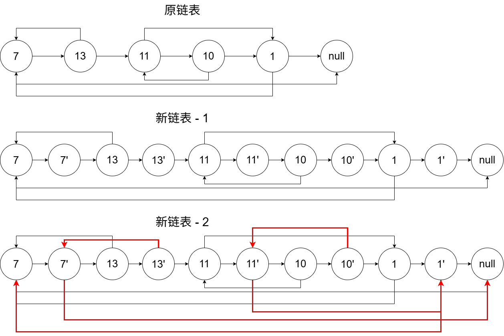
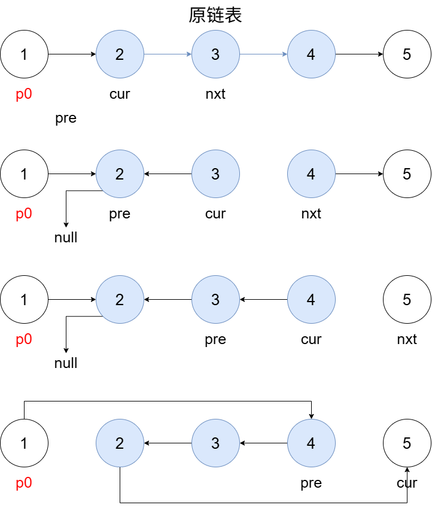

+++
date = '2026-10-09T12:01:54+08:00'
draft = false
title = 'Leetcode 面试150题——链表 总结'
summary = '链表部分题解汇总'
tags = ['Leetcode', '题解汇总', '链表']
series = ['面试150题']
featured = false
math = true
+++

# 环形链表
> 难度：简单

> 标签：哈希表、链表、双指针、Floyd判圈算法

> 链接：[环形链表](https://leetcode.cn/problems/linked-list-cycle/description/?envType=study-plan-v2&envId=top-interview-150)



给你一个链表的头节点`head`，判断链表中是否有环。

如果链表中有某个节点，可以通过连续跟踪`next`指针再次到达，则链表中存在环。 为了表示给定链表中的环，评测系统内部使用整数`pos`来表示链表尾连接到链表中的位置（索引从 0 开始）。注意：`pos`**不作为参数进行传递**。仅仅是为了标识链表的实际情况。

如果链表中存在环，则返回`true`。 否则，返回`false`。



**快慢指针**

依旧判圈，依旧循环，那么就依旧是快慢指针。一个走一步一个走两步，如果快的可以追上慢的那就是有环。




下面给出详细代码：

```go
func hasCycle(head *ListNode) bool {
    slow, fast := head, head
    for fast != nil && fast.Next != nil {
        slow = slow.Next
        fast = fast.Next.Next
        if slow == fast {
            return true
        }
    }
    return false
}
```

---

# 两数相加
> 难度：中等

> 标签：递归、链表、数学

> 链接：[两数相加](https://leetcode.cn/problems/add-two-numbers/description/?envType=study-plan-v2&envId=top-interview-150)



给你两个**非空**的链表，表示两个非负的整数。它们每位数字都是按照**逆序**的方式存储的，并且每个节点只能存储**一位**数字。

请你将两个数相加，并以相同形式返回一个表示和的链表。

你可以假设除了数字 0 之外，这两个数都不会以 0 开头。



就考虑一个进位的问题就好，只要 l1，l2 或者进位还有，就要继续往下计算。




下面给出详细代码：

```go
func addTwoNumbers(l1 *ListNode, l2 *ListNode) *ListNode {
    dummy := &ListNode{}
    cur := dummy
    carry := 0

    for l1 != nil || l2 != nil || carry != 0 {
        sum := carry
        if l1 != nil {
            sum += l1.Val
            l1 = l1.Next
        }
        if l2 != nil {
            sum += l2.Val
            l2 = l2.Next
        }
        cur.Next = &ListNode{Val: sum % 10}
        carry = sum / 10
        cur =cur.Next
    }
    return dummy.Next
}
```

---

# 合并两个有序链表
> 难度：简单

> 标签：递归、链表

> 链接：[合并两个有序链表](https://leetcode.cn/problems/merge-two-sorted-lists/?envType=study-plan-v2&envId=top-interview-150)



将两个升序链表合并为一个新的**升序**链表并返回。新链表是通过拼接给定的两个链表的所有节点组成的。 



思路也是比较简单的。就是一个一个比较，每次都把小的节点放进结果链表。然后如果长度不一样，最后再把多余的直接拼上去。




下面给出详细代码：

```go
func mergeTwoLists(list1 *ListNode, list2 *ListNode) *ListNode {
    dummy := &ListNode{}
    cur := dummy

    for list1 != nil && list2 != nil {
        if list1.Val >= list2.Val {
            cur.Next = list2
            list2 = list2.Next
        } else {
            cur.Next = list1
            list1 = list1.Next
        }
        cur = cur.Next
    }

    if list1 != nil {
        cur.Next = list1
    } else {
        cur.Next = list2
    }

    return dummy.Next
}
```

---

# 随机链表的复制
> 难度：中等

> 标签：哈希表、链表

> 链接：[随机链表的复制](https://leetcode.cn/problems/copy-list-with-random-pointer/description/?envType=study-plan-v2&envId=top-interview-150)



给你一个长度为 n 的链表，每个节点包含一个额外增加的随机指针`random`，该指针可以指向链表中的任何节点或空节点。

构造这个链表的**深拷贝**。深拷贝应该正好由 n 个**全新**节点组成，其中每个新节点的值都设为其对应的原节点的值。新节点的`next`指针和`random`指针也都应指向复制链表中的新节点，并使原链表和复制链表中的这些指针能够表示相同的链表状态。复制链表中的指针都不应指向原链表中的节点 。

例如，如果原链表中有 X 和 Y 两个节点，其中`X.random --> Y`。那么在复制链表中对应的两个节点 x 和 y ，同样有`x.random --> y`。

返回复制链表的头节点。

用一个由 n 个节点组成的链表来表示输入/输出中的链表。每个节点用一个`[val, random_index]`表示：

- `val`：一个表示`Node.val`的整数。
- `random_index`：随机指针指向的节点索引（范围从 0 到 n-1）；如果不指向任何节点，则为`null`。

你的代码**只**接受原链表的头节点`head`作为传入参数。 



图解：



最后再把复制出来的提取出来，顺便还原原来的链表。




下面给出详细代码：

```go
func copyRandomList(head *Node) *Node {
    cur := head
    for cur != nil {
        node := &Node{Val: cur.Val}
        node.Next = cur.Next
        cur.Next = node
        cur = node.Next
    }

    cur = head
    for cur != nil {
        if cur.Random != nil {
            cur.Next.Random = cur.Random.Next
        }
        cur = cur.Next.Next
    }

    dummy := &Node{}
    ans := dummy
    cur = head
    for cur != nil {
        ans.Next = cur.Next
        ans = ans.Next
        cur.Next = ans.Next
        cur = cur.Next
    }
    return dummy.Next
}
```

---

# 反转链表 II
> 难度：中等

> 标签：链表

> 链接：[反转链表 II](https://leetcode.cn/problems/reverse-linked-list-ii/description/?envType=study-plan-v2&envId=top-interview-150)



给你单链表的头指针`head`和两个整数`left`和`right`，其中`left <= right`。请你反转从位置`left`到位置`right`的链表节点，返回**反转后的链表**。



图解：






下面给出详细代码：

```go
func copyRandomList(head *Node) *Node {
    cur := head
    for cur != nil {
        node := &Node{Val: cur.Val}
        node.Next = cur.Next
        cur.Next = node
        cur = node.Next
    }

    cur = head
    for cur != nil {
        if cur.Random != nil {
            cur.Next.Random = cur.Random.Next
        }
        cur = cur.Next.Next
    }

    dummy := &Node{}
    ans := dummy
    cur = head
    for cur != nil {
        ans.Next = cur.Next
        ans = ans.Next
        cur.Next = ans.Next
        cur = cur.Next
    }
    return dummy.Next
}
```

---